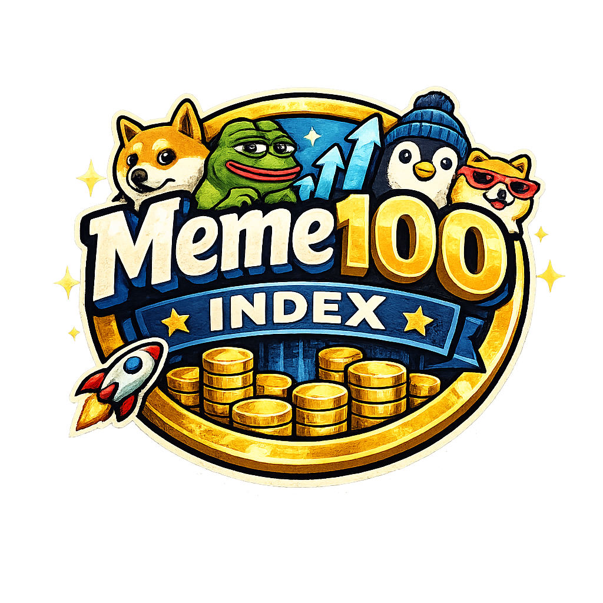

# Meme100 Index

Meme100 Index is a deterministic token distribution mechanism that converts a single purchase event into exposure across the top 100 memecoins.

The system operates mechanically.

There is no discretionary logic.
There is no price targeting.
There is no portfolio management.
There is no yield promise.

A user acquires the Meme100 Index token.
A bot executes a split purchase across a defined basket of memecoins.
The acquired tokens are sent directly back to the user.

The index token is a trigger, not a vault.

---

## Core Concept

Meme100 Index functions as a one-click router.

1. User purchases Meme100 Index token
2. Bot detects purchase event on-chain
3. Purchase amount is normalized
4. Capital is split across 100 predefined memecoins
5. Each asset is purchased via market swap
6. Resulting tokens are transferred directly to the purchaser wallet

The system does not custody user funds.
The system does not rebalance holdings.
The system does not track performance.

---

## Design Philosophy

Meme100 Index is built for users who understand execution.

It assumes:
- Volatility is accepted
- Slippage is expected
- Holdings are unmanaged after distribution

The protocol does not attempt to optimize outcomes.
It executes instructions.

---

## Appendix A: Meme100 Index Constituents

The following list represents the Meme100 Index reference set.

Inclusion is based on historical relevance, peak market capitalization, sustained liquidity, cultural impact, and onchain activity. This list is not static and may evolve between index versions.

The list below reflects the initial Meme100 universe.

                                                                                                          Meme100 Constituents (Alphabetical)

1. Dogecoin (DOGE)
2. Shiba Inu (SHIB)
3. Pepe (PEPE)
4. Bonk (BONK)
5. Floki (FLOKI)
6. dogwifhat (WIF)
7. Baby Doge Coin (BABYDOGE)
8. SafeMoon (SAFEMOON)
9. Saitama (SAITAMA)
10. Hoge Finance (HOGE)
11. Samoyedcoin (SAMO)
12. Cheems (CHEEMS)
13. Kishu Inu (KISHU)
14. Akita Inu (AKITA)
15. Monacoin (MONA)
16. Dogelon Mars (ELON)
17. Pitbull (PIT)
18. Poodl Inu (POODL)
19. CatCoin (CAT)
20. Floki Inu (FLOKI2)

21. Milady Meme Coin (MILADY)
22. Turbo (TURBO)
23. Wojak (WOJAK)
24. Mog Coin (MOG)
25. Brett (BRETT)
26. Toshi (TOSHI)
27. Degen (DEGEN)
28. SPX6900 (SPX)
29. GigaChad (GIGA)
30. Popcat (POPCAT)

31. Book of Meme (BOME)
32. Peanut the Squirrel (PNUT)
33. Moo Deng (MOODENG)
34. Myro (MYRO)
35. Snek (SNEK)
36. ApeCoin (APE)
37. Doge Killer (LEASH)
38. Fartcoin (FARTCOIN)
39. Shiba Predator (QOM)
40. Cult DAO (CULT)

41. Elon Sperm (ESPERM)
42. HarryPotterObamaSonic10Inu (BITCOIN)
43. Jesus Coin (JESUS)
44. Puss in Boots (PIB)
45. Hokkaido Inu (HOKK)
46. Ass Coin (ASS)
47. VoldemortTrumpRobotnikInu (VTRINU)
48. Grimace (GRIMACE)
49. Chad Coin (CHAD)
50. Pika Inu (PIKA)

51. CateCoin (CATE)
52. ShibDoge (SHIBDOGE)
53. DogeBonk (DOBO)
54. Tamadoge (TAMA)
55. Baby Floki (BABYFLOKI)
56. Floki Musk (FLOKIM)
57. Pupper (PUPPER)
58. PepeCash (PEPECASH)
59. Meme Inu (MEME)
60. DogeDash (DOGEDASH)

61. ElonDoge (EDOGE)
62. Klee Kai (KLEE)
63. FlokiRocket (FLOKIR)
64. Husky Inu (HUSKY)
65. Catgirl (CATGIRL)
66. Zombie Inu (ZINU)
67. DogeGF (DOGEGF)
68. Shibaverse (VERSE)
69. CorgiAI (CORGIAI)
70. Kitty Inu (KITTY)

71. Meme Lordz (LORDZ)
72. Doge CEO (DOGECEO)
73. Pepe 2.0 (PEPE2)
74. Moon Pepe (MOONPEPE)
75. ShibaZilla (SHIBZILLA)
76. DogeKing (DOGEKING)
77. InuYasha (INU)
78. Doge Army (DOGA)
79. Fluffy Coin (FLUF)
80. ShibaGalaxy (SHIBGX)

81. MemeFi (MEMEFI)
82. DogeCash (DOGEC)
83. PepeMoon (PEPEMOON)
84. Based Chad (BASED)
85. Wojak Finance (WOJAKF)
86. MoonDoge (MDOGE)
87. ShibaClassic (SHIBC)
88. CatDoge (CATDOGE)
89. Inu Token (INU)
90. DogeInu (DINU)

91. PepeX (PEPEX)
92. MemeCoin (MEMECOIN)
93. Doge 2.0 (DOGE2)
94. Floki Classic (FLOKIC)
95. ShibaRise (SHIBARISE)
96. Moon Inu (MINU)
97. Pepe Inu (PEPEINU)
98. DogeVerse (DOGEVERSE)
99. Meme Protocol (MPRO)
100. Based Meme Coin (BASEDMEME)

---


## Index Composition

The Meme100 basket is defined off-chain and versioned.

Each index version contains:
- Token mint address
- Chain identifier
- Liquidity source
- Weighting rule

Default weighting is equal-weight.

Example schema:

```json
{
  "indexVersion": "v1",
  "assets": [
    {
      "symbol": "DOGE",
      "chain": "ethereum",
      "weight": 0.01,
      "router": "uniswap_v2"
    }
  ]
}
```

Index membership can be updated between versions.
Users always receive assets based on the active version at execution time.

---

## Execution Bot Architecture

The bot operates as a stateless executor.

Components:
- Chain listener
- Swap router
- Transfer dispatcher

### Event Detection

The bot subscribes to token transfer events of the Meme100 Index token.

When a qualifying purchase is detected, the bot extracts:
- Buyer address
- Purchase amount
- Transaction hash

### Normalization

The raw purchase amount is normalized after:
- Router fee
- Gas buffer
- Safety margin

### Split Execution

The normalized amount is divided equally across 100 assets.

Each swap is executed independently.
Failures do not halt the full batch.

---

## Example Execution Logic (TypeScript)

```ts
for (const asset of indexAssets) {
  try {
    const amount = totalAmount * asset.weight;
    const swapTx = await router.swap({
      fromToken: baseToken,
      toToken: asset.mint,
      amount,
      recipient: buyerAddress
    });
    await confirm(swapTx);
  } catch (err) {
    logFailure(asset.symbol, err);
  }
}
```

---

## Security Model

- No pooled custody
- No user approvals beyond swap execution
- No private key reuse across chains

Keys are rotated.
Execution limits are enforced.
Transaction simulation is performed before broadcast.

---

## Non-Goals

Meme100 Index does not:
- Guarantee returns
- Act as an ETF
- Track price indices
- Optimize allocations
- Provide financial advice

This is a mechanical routing system.

---

## Intended Audience

This project is designed for:
- On-chain power users
- Trench participants
- Engineers experimenting with execution primitives

It is not designed for retail onboarding.

---

## License

MIT
